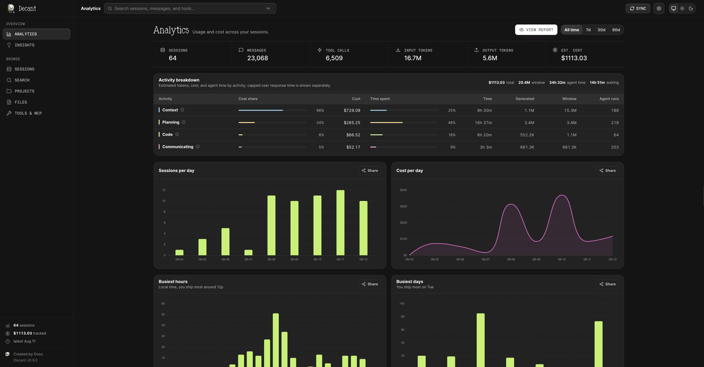

# Decant

[](https://www.npmjs.com/package/@dosu/decant)
[](https://www.npmjs.com/package/@dosu/decant)
[](https://github.com/dosu-ai/decant/actions/workflows/ci.yml)
[](https://scorecard.dev/viewer/?uri=github.com/dosu-ai/decant)
[](LICENSE)

Decant turns the Claude Code and Codex session logs on your machine into
tangible insights. See where tokens, cost, and agent time go, inspect context
usage, find the files and tools agents touch, and search complete transcripts
from a CLI or local web UI.

Decant is local-first. It makes no outbound network calls at runtime,
and your transcripts never leave your machine.

Built by
[Dosu](https://dosu.dev?utm_source=decant&utm_medium=github&utm_campaign=attribution&utm_content=readme),
Knowledge Infrastructure for Agents. Dosu makes agents faster, cheaper, and
more effective across every run.



## Quick start

Run Decant with `npx` with no Bun install or global package required.

```sh
npx @dosu/decant@latest
```

This starts the local UI at <http://127.0.0.1:3000>, indexes the Claude Code and
Codex logs on your machine, and watches for changes.

## What you get

- One SQLite archive for Claude Code and Codex sessions.
- Full-text search across messages, tool calls, and transcripts.
- Token, [estimated cost](docs/pricing.md), context, activity, tool, MCP, and
  file analytics.
- Browsable sessions, projects, files, and ingest diagnostics.
- Markdown, JSON, report, and trajectory exports.
- Deterministic scripts, replays, and agent instructions distilled from command
  history.

## Install

Published binaries support macOS and Linux on x64 and arm64. Native Windows
binaries are not currently available.

Install a persistent command with npm:

```sh
npm install --global @dosu/decant@latest
decant
```

Or use Homebrew:

```sh
brew install dosu-ai/dosu/decant
decant
```

Or install the latest release without Node.js or Bun:

```sh
curl -fsSL https://raw.githubusercontent.com/dosu-ai/decant/main/install.sh | sh
decant
```

See [Distribution](docs/distribution.md) for installer options, Docker, source
builds, and release verification.

## Docker

```sh
docker run --rm \
  -p 127.0.0.1:3000:3000 \
  -v decant-data:/var/lib/decant \
  -v "$HOME/.claude/projects:/sources/claude:ro" \
  -v "$HOME/.codex:/sources/codex:ro" \
  ghcr.io/dosu-ai/decant:latest
```

Keep the `127.0.0.1:` prefix. Publishing `-p 3000:3000` exposes the
unauthenticated archive API on every host interface. Custom container networks
may need the trusted-peer setting documented under
[Docker distribution](docs/distribution.md#docker).

## CLI

```sh
decant                         # start the local web UI
decant sync                    # index new and changed sessions
decant ls                      # list sessions
decant show 1                  # render a transcript
decant search "auth bug"       # full-text search
decant stats --by model        # usage and cost rollups
decant economics               # token, cost, and time breakdowns
decant files --group ext       # file hotspots
decant tool stats              # tool usage
decant mcp stats               # MCP server usage
decant export 1 > session.md   # export a session
```

Run `decant --help` or `decant <command> --help` for all commands and flags.
Read commands support `--json`; global flags include `--db`, `--format`,
`--quiet`, `--no-color`, and `--no-sync`.

To index selected files or a temporary source tree:

```sh
decant --db /tmp/decant.db sync --path ./session.jsonl --path ./sessions
```

## Local API

The OpenAPI 3.1 contract is [docs/api/openapi.yaml](docs/api/openapi.yaml), and
a running server exposes it at
<http://127.0.0.1:3000/api/openapi.json>. See [API recipes](docs/api/recipes.md)
for examples.

## Documentation

- [Analytics methodology](docs/analytics-methodology.md)
- [Pricing estimates](docs/pricing.md)
- [Archive and data lifecycle](docs/data-lifecycle.md)
- [Local Serve API](docs/api/routes.md)
- [Distribution and release verification](docs/distribution.md)
- [Architecture](docs/architecture.md)

## Contributing

Contributions are welcome. Read [CONTRIBUTING.md](CONTRIBUTING.md) for setup,
tests, and privacy requirements. Coding agents should also read
[AGENTS.md](AGENTS.md).

Use synthetic session data in issues and tests. Real transcripts can contain
source code, prompts, credentials, and local paths.

## Security

Report vulnerabilities privately as described in [SECURITY.md](SECURITY.md).

## About Dosu

Decant is built and maintained by
[Dosu](https://dosu.dev?utm_source=decant&utm_medium=github&utm_campaign=attribution&utm_content=about),
Knowledge Infrastructure for Agents. Dosu makes agents faster, cheaper, and
more effective across every run. Decant shows what your agents spent, read, and
touched via your agent logs.

## Acknowledgments

Decant was inspired in part by
[Letta's Trajectory](https://github.com/letta-ai/trajectory), which normalizes
agent transcripts across runtimes into a shared record format.

## License

Decant is licensed under the [Apache License 2.0](LICENSE).
